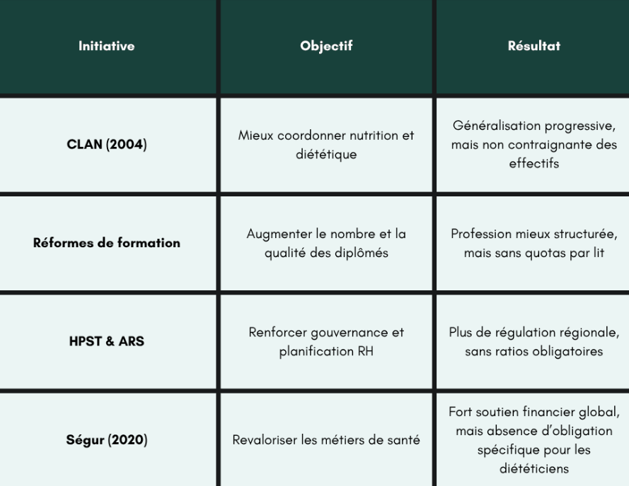

# Business plan
### Who are the targets ?
- Our targets are mostly the students in university that dont know what to cook or to have a healthy meal with their leftovers.
- But also, people in general who want to eat healthier or want to do a diet 

### Their needs
- It could be to diversify their lunch and to minimize their waste by using all the leftovers and ingredient people or students have. 
- It could be to want to do a diet but don't know how to eat healthier, with which meal and can't take a coach to help him.

### Our chatbot goal
The goals are to help people to have better meal by giving a meal base on what they have, their weight and their needs. And to automate the meal to maintain their goals.

---
---
## business impact
1. It permits for people to save time by asking directly to a chatbot
    - instead of asking to a dietician, people can ask directly to the chatbot. It permits to for people to save time by having an instant response
    - It "replace" a dietician in terms of what meal they can cook depending on the people condition.
2. It can also help dietician in their work
    - it permits to them to have a less amount of work for each patients. To do some automate about the patients nutrition.

## Return on investment

1. In France, there are approximately 18 000 dieticians. According to the datas of Adeli, in May 2025, there are 12 dieticians for 100 000. With around 70% of them using our bot to help. they are 20% more efficient with their patients.

### some initiatives to reinforce the ratio of patients:

2. from an article of Ipsos, In 2015, 44% of French people have already did a diet. And about 58% fail this diet. One of the reasons is the revocation of their usual meal. With our chatbot making proposing a meal for them and their needs, we reduce the people that fail their diet from 15% to 30%. Indeed, the meal proposed dont revocate the nutrition but adjust to be better from what they have usually.
